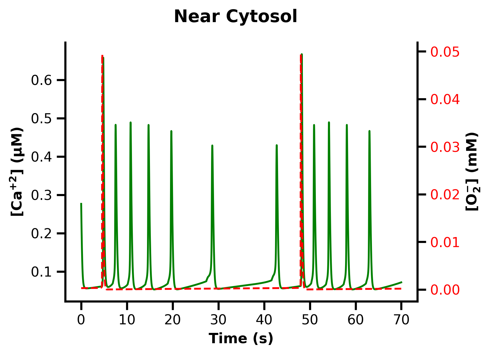

# 1. Introduction


The **Model.ipynb** notebook provides a numerical solution to a system of ordinary differential equations developed in the study:  
**"A dynamic model of calcium frequency modulation by mitochondrial superoxide"**  
Available on bioRxiv: [doi.org/10.1101/2025.07.28.667258](https://doi.org/10.1101/2025.07.28.667258)

This simulation explores how mitochondrial superoxide influences calcium dynamics through a proposed frequency modulation mechanism.

---

# 2. Prerequisites

### Required Software
- **Python 3** (Download from [python.org](https://www.python.org). During installation, make sure to check **"Add Python to PATH"**.)

### Required Python Packages
- `numpy`  
- `scipy`  
- `matplotlib`  
- `notebook`  

You can install these packages via pip in a terminal or cmd:

```bash
pip install numpy scipy matplotlib notebook
```

---

# 3. How to Run the Notebook

1. Open a terminal or cmd
2. Launch the Jupyter Notebook environment:

   ```bash
   jupyter notebook
   ```
3. In the browser window that opens, navigate to the folder containing **Model.ipynb** and open it

4. Run the code cells by clicking the Run (▶) button or pressing **Shift + Enter**

---

# 4. Output

The simulation may take approximately 1–5 minutes to run. Once completed, it will generate output visualization as shown below:

<div align="center">
  
</div>


